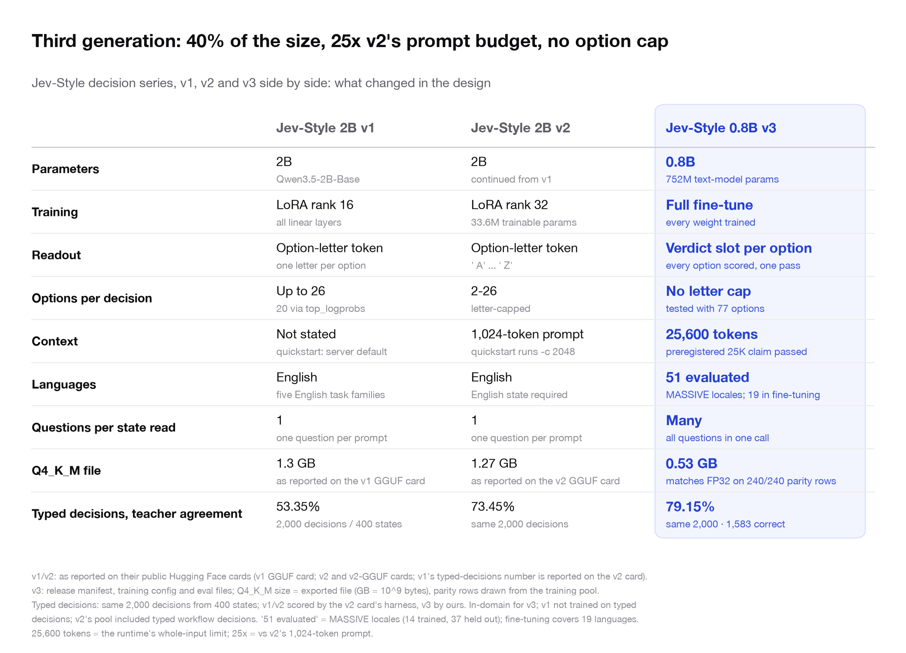
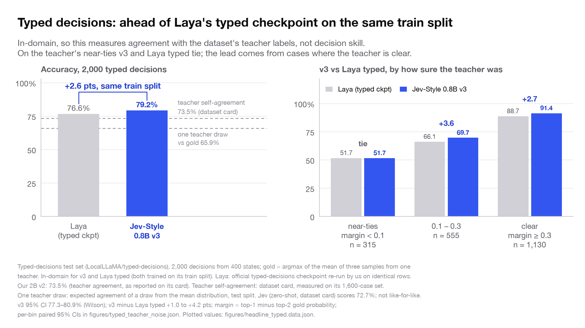
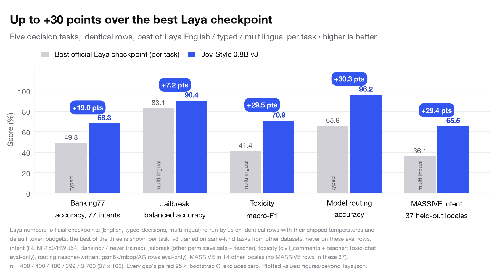
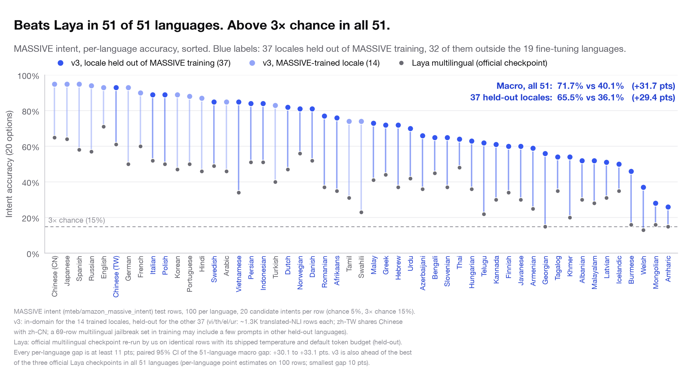
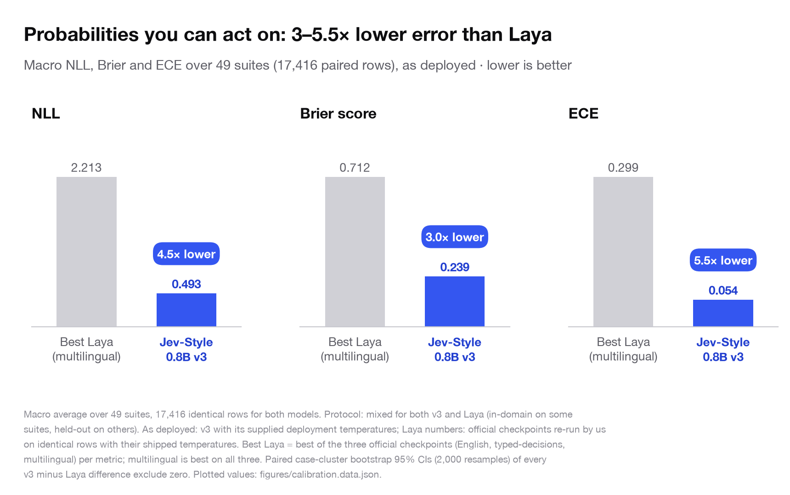
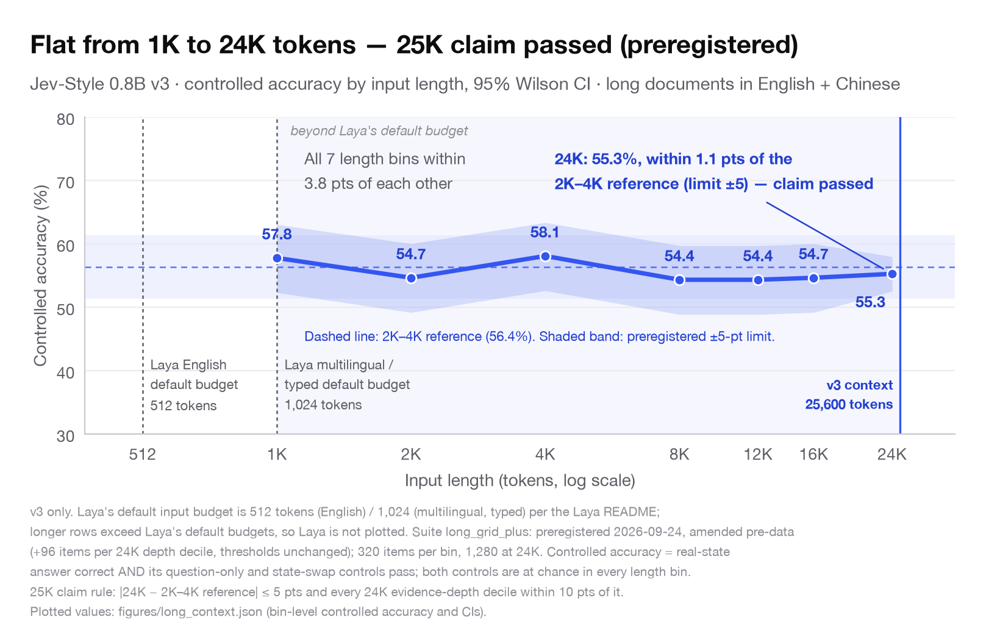
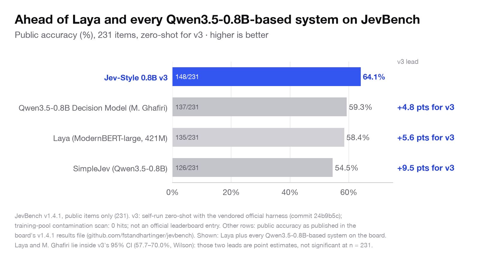
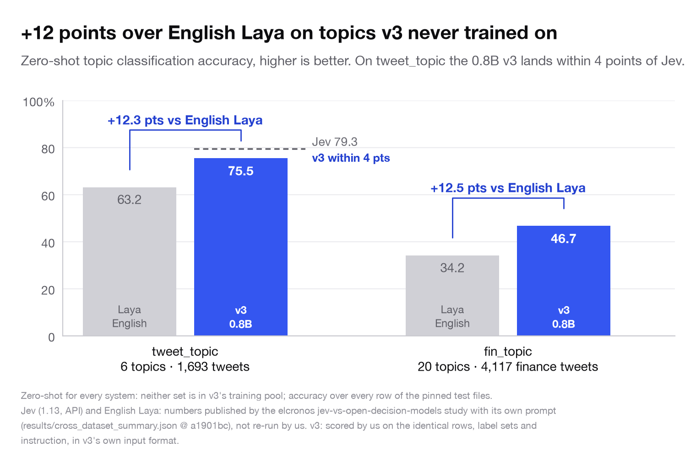
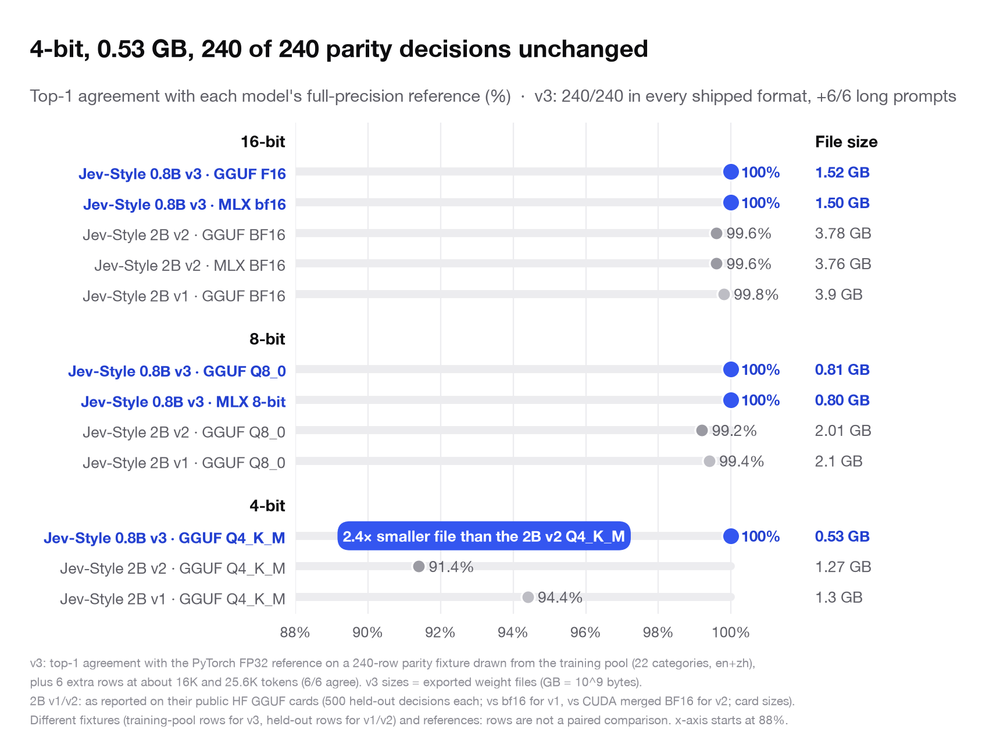

# Jev-Style-0.8B-Decision-v3

**Jev-Style decision series:** [v1 · 2B](https://huggingface.co/chaoliangUNSW/Jev-Style-Qwen3.5-2B-Decision-GGUF) → [v2 · 2B](https://huggingface.co/chaoliangUNSW/Jev-Style-Qwen3.5-2B-Decision-v2) → **v3 · 0.8B (this model)** · **Website:** [jevstyle.com](https://jevstyle.com/#v3) · **Collection:** [all v3 builds and demos](https://huggingface.co/collections/chaoliangUNSW/jev-style-08b-decision-v3-6ab58abb90ae4b7b55578b3e)

**Jev-style decisions on your laptop.** Give it any text and a question; it returns a calibrated probability for every option in one forward pass. 0.8B parameters, open weights, Apache-2.0.


| | **Jev-Style v3 · 0.8B** | Laya typed | Jev (API) |
|---|:---:|:---:|:---:|
| Typed decisions, accuracy ↑ | **79.2%** | 76.6% | 72.7%¹ |
| Probability error, Brier ↓ | **0.046** | 0.061 | 0.148¹ |
| Runs on your own machine | **Yes, 0.53 GB (4-bit GGUF)** | Yes | No, API only |
| Longest input per call | **25,600 tokens** | 1,024 by default² | not published |

<sub>¹ Same 2,000 typed decisions (LocalLLaMA/typed-decisions). v3 and Laya typed were trained on its train split; Jev is zero-shot, with numbers from the dataset card. Protocol and paired confidence intervals: see [Typed decisions](#typed-decisions-08b-beats-the-2b-models-and-jev). ² Default input budget in the Laya README: 1,024 tokens for the multilingual and typed checkpoints, 512 for English.</sub>

**Reads long documents in one call.** Up to 25,600 tokens of input, 25× Laya's 1,024-token default and 25× our 2B v2's prompt. On 1,280 real 24K-token items v3 answers **98.3%** correctly, and accuracy stays flat from 1K to 24K tokens (preregistered claim, passed).

**Also:** +30.3 points over the best official Laya checkpoint on model routing · ahead of Laya multilingual in 51 of 51 languages.

**[Try it in your browser →](https://huggingface.co/spaces/chaoliangUNSW/jev-style-v3)**

## Quick start

```bash
pip install -U huggingface_hub
hf download chaoliangUNSW/Jev-Style-0.8B-Decision-v3 --local-dir jev-v3 && cd jev-v3
pip install -r requirements.txt          # torch, transformers>=5.0, tokenizers, numpy
```

```python
from jev_style_decision import JevStyleDecision

m = JevStyleDecision(".")                # CUDA, Apple MPS or CPU
r = m.decide({"ticket": "I was charged twice for my subscription this month.", "customer_tier": "pro"},
             "Which team should handle this ticket?",
             options={"billing": "payments, invoices, refunds", "technical": "bugs and outages", "sales": "new purchases"},
             category="theme_routing")
print(r["answer"], r["probabilities"])   # billing ≈ 0.978 (CPU, float32)
```

Other builds: [GGUF for llama.cpp](https://huggingface.co/chaoliangUNSW/Jev-Style-0.8B-Decision-v3-GGUF) (0.53–1.52 GB) · [MLX for Apple silicon](https://huggingface.co/chaoliangUNSW/Jev-Style-0.8B-Decision-v3-MLX) (0.80–1.50 GB) · more usage [below](#usage-in-detail-transformers).

## What's new in v3

- **Smaller and stronger.** 0.8B instead of 2B, and 79.2% vs 73.5% for our 2B v2 on the same 2,000 typed decisions.
- **No letter cap.** v1 and v2 read one option-letter token, so a question could have at most 26 options. v3
  scores a verdict slot per option, so the options are whatever you pass. Banking77 was run with all 77 intents
  in one pass.
- **25× the prompt budget.** v2's interface is a 1,024-token prompt. v3 takes 25,600 tokens, and its long-context
  claim was preregistered and passed.
- **Read once, ask many.** v1 and v2 put one question in each prompt. v3 renders the state once and answers any
  number of questions about it. With 10 questions on a 4K-token state this is 4.6× faster (GGUF, `many_mode="batched"`) than a
  Laya-architecture engine (our round-1 MacLaya-4K) that calls once per question.

| **0.8B** | **25,600 tokens** | **77 options** | **51 languages** | **0.53 GB** |
|:---:|:---:|:---:|:---:|:---:|
| parameters, full fine-tune | input, preregistered 25K claim passed | scored in one pass (largest tested) | evaluated on MASSIVE intent | 4-bit Q4_K_M; same top-1 as FP32 on 240/240 parity rows |

| Build | Size | Runtime |
|---|---:|---|
| **Transformers safetensors (bf16) · this repository** | 1.50 GB | PyTorch on CUDA, Apple MPS or CPU (`jev_style_decision.py`) |
| [GGUF F16 / Q8_0 / Q4_K_M](https://huggingface.co/chaoliangUNSW/Jev-Style-0.8B-Decision-v3-GGUF) | 1.52 / 0.81 / 0.53 GB | llama.cpp + the bundled `jev-score` scorer |
| [MLX bf16](https://huggingface.co/chaoliangUNSW/Jev-Style-0.8B-Decision-v3-MLX/tree/main/bf16) / [8-bit](https://huggingface.co/chaoliangUNSW/Jev-Style-0.8B-Decision-v3-MLX/tree/main/8bit) (one repository) | 1.50 / 0.80 GB | Apple silicon, mlx-lm (one runtime, `--precision`) |

<details>
<summary><strong>v1 → v2 → v3, side by side</strong></summary>



<sub>v1/v2: as reported on their public Hugging Face cards (v1 GGUF card; v2 and v2-GGUF cards; v1's typed-decisions number is reported on the v2 card). v3: release manifest, training config and evaluation files; Q4_K_M size = exported file (GB = 10^9 bytes), parity rows drawn from the training pool. Typed decisions: same 2,000 decisions from 400 states; v1/v2 scored by the v2 card's harness, v3 by ours. In-domain for v3; v1 was not trained on typed decisions; v2's pool included typed workflow decisions. "51 evaluated" = MASSIVE locales, 14 trained + 37 held out; the fine-tuning pool covers 19 languages. 25,600 tokens = the runtime's whole-input limit, 25× v2's 1,024-token prompt.</sub>


| | Jev-Style 2B v1 | Jev-Style 2B v2 | **Jev-Style 0.8B v3** |
|---|---|---|---|
| Parameters | 2B (Qwen3.5-2B-Base) | 2B (continued from v1) | **0.8B** (752M text-model parameters) |
| Training | LoRA rank 16 (all linear layers) | LoRA rank 32 (33.6M trainable parameters) | **Full fine-tune** (every weight trained) |
| Readout | Option-letter token (one letter per option) | Option-letter token (' A' ... ' Z') | **Verdict slot per option** (every option scored, one pass) |
| Options per decision | Up to 26 (20 via top_logprobs) | 2–26 (letter-capped) | **No letter cap** (tested with 77 options) |
| Context | Not stated (quickstart: server default) | 1,024-token prompt (quickstart runs -c 2048) | **25,600 tokens** (preregistered 25K claim passed) |
| Languages | English (five English task families) | English (English state required) | **51 evaluated** (MASSIVE locales; 19 languages in fine-tuning) |
| Questions per state read | 1 (one question per prompt) | 1 (one question per prompt) | **Many** (all questions in one call) |
| Q4_K_M file | 1.3 GB (as reported on the v1 GGUF card) | 1.27 GB (as reported on the v2 GGUF card) | **0.53 GB** (matches FP32 on 240 / 240 parity rows) |
| Typed decisions, teacher agreement | 53.35% (2,000 decisions / 400 states) | 73.45% (same 2,000 decisions) | **79.15%** (same 2,000; 1,583 correct) |

</details>

## Results

### Typed decisions: 0.8B beats the 2B models and Jev



At 0.8B parameters, v3 scores **79.2%** on the 2,000 typed decisions. That is **+6.4 points over Jev**, +5.7 over
our 2B v2 and +2.6 over Laya's typed checkpoint, and the Brier score is **3.2× lower than Jev's** (0.046 vs 0.148).

<sub>Typed-decisions test set (LocalLLaMA/typed-decisions), 2,000 decisions from 400 states. In-domain for v3 and Laya typed (both trained on its train split); zero-shot for Jev (numbers from the dataset card, measured through the Jev API on all 2,000 decisions). Laya: official typed-decisions checkpoint re-run by us on identical rows with its shipped temperature. 2B v1/v2: teacher agreement as reported on the v2 card (same 2,000 decisions, scored by that card's harness; v1 was not trained on typed decisions, v2's training pool included typed workflow decisions). Jev's accuracy is published as 0.727, so the gap is 6.40–6.50 points. v3: 1,583 / 2,000 correct, 95% CI 77.3–80.9% (Wilson); v3 minus Laya typed, paired bootstrap 95% CI +1.0 to +4.2 points.</sub>

**Head-to-head against Laya's typed checkpoint.** Both models trained on this dataset's train split, and v3 wins on all four
metrics, each with a paired 95% CI that excludes zero:

| Metric (2,000 decisions) | Laya typed-decisions checkpoint | **Jev-Style 0.8B v3** | Difference, paired 95% CI |
|---|---:|---:|---|
| Accuracy ↑ | 76.6% | **79.2%** | +2.6 pts [+1.0, +4.2] |
| Soft accuracy ↑ | 47.1% | **52.4%** | +5.4 pts [+5.0, +5.7] |
| Brier vs soft labels ↓ | 0.061 | **0.046** | −0.016 [−0.019, −0.012] |
| Score-question MAE ↓ | 0.242 | **0.195** | −0.047 [−0.060, −0.035] |

<sub>Both in-domain; v3 also trained on 27,300 synthetic typed items from other workflows. Laya: official checkpoint re-run by us on identical rows with its shipped temperature. Paired case-cluster bootstrap within suites, 2,000 resamples.</sub>

<details>
<summary><strong>More results:</strong> +30 points over Laya · 51 languages · calibration · 24K-token documents · JevBench · zero-shot topics · speed · 4-bit parity</summary>

### Beyond Laya: up to +30 points



**On five decision tasks scored on identical rows, the 0.8B v3 beats the best official Laya checkpoint on every
one:** +19.0 points on 77-way Banking77, +7.2 balanced accuracy on jailbreak detection, +29.5 macro-F1 on
toxicity, +30.3 on model routing and +29.4 across the 37 locales held out of MASSIVE training.

<sub>Laya numbers: official checkpoints (English, typed-decisions, multilingual) re-run by us on identical rows with their shipped temperatures and default token budgets; the best of the three is shown per task. v3 trained on tasks of the same kind from other datasets, never on these evaluation rows: intent (CLINC150/HWU64; Banking77 never trained), jailbreak (other permissive sets plus teacher data), toxicity (civil_comments plus teacher data; toxic-chat is evaluation-only), routing (teacher-written; the gsm8k/mbpp/AG rows are evaluation-only), MASSIVE in 14 other locales (no MASSIVE rows in these 37). n = 400 / 400 / 400 / 399 / 3,700 (37 × 100). Every gap's paired 95% bootstrap CI excludes zero.</sub>

### 51 languages, 51 wins



**One 0.8B model, 51 languages, 51 wins over Laya.** On MASSIVE intent (20 options per question) v3 averages
**71.7%** across 51 languages, against 40.1% for the official Laya multilingual checkpoint (+31.7 points). It
beats Laya multilingual in every one of the 51 languages, by at least 11 points, and stays above 3× chance in all
of them. That includes the 37 locales held out of MASSIVE training (65.5% vs 36.1%), 32 of them outside the 19
fine-tuning languages.

<sub>MASSIVE intent (mteb/amazon_massive_intent) test rows, 100 per language, 20 candidate intents per row (chance 5%, 3× chance 15%); accuracy = top-scored option. v3: in-domain for the 14 trained locales, held out for the other 37 (vi/th/el/ur had about 1.3K translated-NLI training rows each; zh-TW shares Chinese with zh-CN; a 69-row multilingual jailbreak set in training may include a few prompts in other held-out languages). Laya: official multilingual checkpoint re-run by us on identical rows with its shipped temperature and default token budget (held-out for Laya). v3 is also ahead of the best of the three official Laya checkpoints in all 51 languages (per-language point estimates on 100 rows each, smallest gap 10 points). Paired 95% CI of the 51-language macro difference: +30.1 to +33.1 points.</sub>

### Probabilities you can act on



**Across 49 suites and 17,416 identical rows, v3's probabilities beat the best official Laya checkpoint on all three
probability-quality metrics:** **4.5× lower NLL** (0.493 vs 2.213), **3.0× lower Brier** (0.239 vs 0.712) and
**5.5× lower ECE** (0.054 vs 0.299).

<sub>Macro average over 49 suites, 17,416 identical rows for both models. Mixed protocol for both v3 and Laya (in-domain on some suites, held-out on others). As deployed: v3 with its supplied temperatures; Laya with the shipped temperatures of its official checkpoints, re-run by us on identical rows. Best Laya = best of the three official checkpoints per metric (multilingual on all three). Paired case-cluster bootstrap 95% CIs (2,000 resamples) of every difference exclude zero.</sub>

**Stable under option shuffling.** When the options are presented in a different order, v3 changed its answer on
**1 of 200** option-order pairs (0.5%), against 22 of 200 (11.0%) for the best Laya checkpoint.

<sub>MASSIVE intent English, 200 option-permutation pairs, identical rows. In-domain for v3, held-out for Laya (typed-decisions checkpoint, the best of the three here). Paired 95% CI of the difference: −15.0 to −6.5 points.</sub>

### Long context: flat from 1K to 24K tokens



**v3 reads documents far past Laya's 512 / 1,024-token default budgets.** Controlled accuracy stays within 3.8
points across all seven length bins. At 24K it is 55.3%, 1.1 points from the 2K–4K reference (56.4%) and well
inside the preregistered ±5-point limit, so **the 25K claim passed**. In plain accuracy, v3 answers **98.3%**
(1,258 of 1,280) of the real 24K-token items correctly and at least 96.9% in every length bin. The same questions
with the state removed or swapped for another item's state fall to chance (28.9% and 28.5%, against 28.4% chance
at 24K), so the answers cannot be recovered from the question alone.

<sub>v3 only. Laya's default input budget is 512 tokens (English) / 1,024 (multilingual, typed) per the Laya README, so Laya is not plotted. Suite long_grid_plus, English and Chinese documents: preregistered 2026-09-24 and amended before any model was scored (+96 items per 24K depth decile, thresholds unchanged); 320 items per bin, 1,280 at 24K. Controlled accuracy = the real item is correct AND its question-only and state-swap controls pass; both controls are at chance in every length bin. 25K claim rule: |24K − 2K–4K reference| ≤ 5 points and every 24K evidence-depth decile within 10 points of it.</sub>

### JevBench: ahead of Laya and every Qwen3.5-0.8B-based system



**On the 231 public JevBench v1.4.1 items, v3 scores 64.1% zero-shot**: 5.6 points above Laya, and ahead of every
Qwen3.5-0.8B-based system on the board, including a dedicated 0.8B decision fine-tune (+4.8 points) and
SimpleJev on the same base (+9.5 points). Every answer is a valid option (231 of 231), because v3 can only score
the options it is given.

<sub>JevBench v1.4.1, public items only (231). v3: self-run zero-shot with the vendored official harness (commit 24b9b5c), 148 / 231 correct, 95% CI 57.7–70.0% (Wilson); training-pool contamination scan: 0 hits; not an official leaderboard entry. Other rows: public accuracy as published in the board's [v1.4.1 results file](https://github.com/fstandhartinger/jevbench). Shown: Laya plus every Qwen3.5-0.8B-based system on the board; other board systems are not shown. Laya's and M. Ghafiri's scores lie inside v3's 95% CI, so those two leads are point estimates, not significant at n = 231.</sub>

### Zero-shot topics: +12 points over English Laya



**On two topic sets it never trained on, v3 leads English Laya by +12.3 points on tweet_topic** (75.5% vs 63.2%)
**and +12.5 points on the 20-way fin_topic** (46.7% vs 34.2%). On tweet_topic it lands **within 4 points of Jev**
(75.5% vs 79.3%). Macro-F1 leads over English Laya are +13.8 points (59.9% vs 46.1%) and +8.9 points (45.2% vs 36.2%).
With its shipped temperature, its probabilities are also better calibrated than Jev's on both sets: ECE 0.027 vs
0.063 on tweet_topic and 0.046 vs 0.166 on fin_topic.

<sub>Zero-shot for every system: neither set is in v3's training pool; accuracy over every row of the pinned test files (n = 1,693 and 4,117). Jev (1.13, API) and English Laya: numbers published by the [elcronos jev-vs-open-decision-models study](https://github.com/elcronos/jev-vs-open-decision-models) with its own prompt (results/cross_dataset_summary.json @ a1901bc), not re-run by us. v3: scored by us on the identical rows, label sets and instruction, in v3's own input format; tweet_topic accuracy 95% CI 73.4–77.5%. ECE: 15 equal-width bins as in the study; v3 with its shipped global temperature (0.880, fitted on v3's own calibration split, never on these sets), Jev's ECE as published (raw API probabilities).</sub>

### Speed: many questions, one read


**Ask many questions about one long state and v3 pulls away.** v3 reads the state once and scores every question
in a single call (GGUF runtime, `many_mode="batched"`; the default exact mode shares whole 1,024-token chunks of the
state and gives results identical to one call per question). With 5 to 10 questions per state, that makes it **1.4× to 1.9× faster** than a Laya-architecture
engine (our round-1 MacLaya-4K) on 1K-token states and **2.6× to 4.6× faster** on 4K-token states (4K tokens with
10 questions: 1,381 ms vs 6,364 ms). It also answers
questions about 8K-token states in 2.3 to 2.6 s, which the 4K-budget engine cannot run at all.

<sub>Identical-architecture timing: untrained Qwen3.5-0.8B export (latency does not depend on the weights). v3 = llama.cpp GGUF F16, one call per state with all questions scored together (`many_mode="batched"` in the GGUF runtime). Comparison engine = round-1 MacLaya-4K, our own fine-tune of the Laya multilingual architecture (4,096-token budget, FP32 on Apple MPS), one call per question; it is not an official Laya checkpoint. Compared at 5 and 10 questions per state. Apple M1 Max 64 GB, warm end-to-end p50, idle run 2026-09-23, prefix reuse off.</sub>

### Quantization: 4-bit, 0.53 GB, same calls



**Quantize it to 4-bit and it still makes the same call.** Every shipped v3 format (GGUF F16, Q8_0 and Q4_K_M;
MLX bf16 and 8-bit) matches the PyTorch FP32 model on **240 of 240 parity rows**, plus 6 of 6 prompts of about 16K
and 25.6K tokens. The 0.53 GB Q4_K_M file is about **2.4× smaller** than the 2B v2's Q4_K_M (1.27 GB).

<sub>v3: top-1 agreement with the PyTorch FP32 reference on 240 parity rows (a mixed fixture drawn from the training pool, 22 categories, English and Chinese), plus 6 extra rows at about 16K and 25.6K tokens (3 each), where every format also agrees 6/6. v3 sizes are the exported weight files (GB = 10^9 bytes). 2B v1/v2 numbers and sizes are as reported on their public Hugging Face GGUF cards: 500 held-out decisions each, against bf16 for v1 and CUDA merged BF16 for v2. The fixtures (training-pool rows for v3, held-out rows for v1/v2) and references differ, so the rows are not a paired comparison and no agreement gap is claimed.</sub>

</details>

## What "Jev-style" means

[Jev](https://typesafe.ai/blog/introducing-system-one-models-and-jev) (TypeSafe AI, 2026) introduced *System One*
decision models. Instead of generating text, the model takes a state and a typed question and returns a probability
for each allowed answer in a single pass. Jev-Style models follow that pattern with open weights:

- **choice**: pick one of N named options, with a probability for each;
- **noul** (yes/no): the probability that a statement about the state is true;
- **score**: a distribution over 2 to 10 ordered levels.

The model cannot answer outside the options it is given, and it never decodes text.

> **Independent project.** Jev-Style is not affiliated with, endorsed by or connected to TypeSafe AI or Jev, and no
> Jev weights, code or outputs are used. It is also not affiliated with the Laya authors or the Qwen team. Jev and
> Laya numbers on this card come from the sources named under each result.

## Usage in detail (transformers)

```bash
pip install -U huggingface_hub
hf download chaoliangUNSW/Jev-Style-0.8B-Decision-v3 --local-dir jev-v3
cd jev-v3
pip install -r requirements.txt      # torch, transformers>=5.0 (Qwen3.5 support), tokenizers, numpy
```

The repository ships `jev_style_decision.py`, a self-contained runtime. It handles input rendering, the verdict
readout, the fitted temperatures and budget checks.

```python
from jev_style_decision import JevStyleDecision

m = JevStyleDecision(".")        # float32 on CUDA, Apple MPS or CPU (device="cpu" to force)
r = m.decide(
    {"ticket": "I was charged twice for my subscription this month.", "customer_tier": "pro"},
    "Which team should handle this ticket?",
    options={"billing": "payments, invoices, refunds",
             "technical": "bugs and outages",
             "sales": "new purchases"},
    category="theme_routing",
)
print(r["answer"], r["probabilities"])
# billing  (probabilities ≈ billing 0.978, sales 0.017, technical 0.004 on CPU, float32)
```

Other question types, and several questions about one state:

```python
state = "Order #1182: paid, packed, handed to the courier on Monday. Tracking shows 'delivered' on Wednesday."
m.decide(state, "Has the order been delivered?", qtype="noul")                       # {"false": p, "true": p}
m.decide(state, "How urgent is a follow-up?", qtype="score",
         options=["not urgent", "somewhat urgent", "urgent", "critical"])            # levels "0".."3"
m.decide_many(state, [
    {"t": "noul", "ins": "Was the order paid?", "crit": None},
    {"t": "choice", "ins": "Which step is the order at?",
     "crit": {"packing": None, "in transit": None, "delivered": None}},
])
```

From the command line:

```bash
python jev_style_decision.py --state "The film was excellent." \
  --question "What is the sentiment of this review?" \
  --options '["negative", "positive"]' --category general_sentiment
# -> "answer": "positive", probability 0.989
```

`decide` returns a dict with `answer`, `probabilities`, the raw `scores`, the `temperature` used,
`top_probability`, `entropy_concentration`, `input_tokens`, `head_tokens`, `model` and `backend`. Batch mode reads JSON lines (`--jsonl file|-`), and
`--verify` checks every file against the sha256 manifest before loading.

**GGUF (llama.cpp):** [Jev-Style-0.8B-Decision-v3-GGUF](https://huggingface.co/chaoliangUNSW/Jev-Style-0.8B-Decision-v3-GGUF).
It includes `jev_score.cpp`, a small libllama scorer that reads logits only at the verdict slots and scores many
questions on one decoded state, plus `jev_style_decision_gguf.py` with the same API.

**MLX (Apple silicon):** [Jev-Style-0.8B-Decision-v3-MLX](https://huggingface.co/chaoliangUNSW/Jev-Style-0.8B-Decision-v3-MLX),
with the [bf16](https://huggingface.co/chaoliangUNSW/Jev-Style-0.8B-Decision-v3-MLX/tree/main/bf16) and
[8-bit](https://huggingface.co/chaoliangUNSW/Jev-Style-0.8B-Decision-v3-MLX/tree/main/8bit) weights in two folders
and one `jev_style_decision_mlx.py` (`--precision bf16|8bit`) with the same API.

## Input format and readout

Each segment is tokenised on its own and the pieces are concatenated. Text inside the state or the options is
tokenised with special tokens disabled, so a string such as `<|im_end|>` in user data stays plain text.

```text
State:
<state: plain text, or any JSON value serialised with ensure_ascii=False>

Question [<choice|noul|score>]: <question>
Options:
- <option 1>
- <option 2>
Judge each option:
<option 1> ->
<option 2> ->
```

- **Verdict slot.** The hidden state at the ` ->` token that ends option k's line is option k's verdict slot. Its
  score is `logit(" yes") − logit(" no")` at that position, computed as `h_k · (w_yes − w_no)` from the final
  normalised hidden state and the tied embedding rows, in float32. No parameters are added, so the weights stay a
  standard Qwen3.5 text model.
- **Probabilities.** `softmax(scores / T)`. `T` is looked up by calibration family × question type × option-count
  bucket in `readout_config.json` (20 fitted groups), and the global value 0.880 is the fallback. Pass
  `category=` (for example `theme_routing`, `general_topic`, `intent`, `typed_official`) to pick the family. With
  no `category`, the runtime uses the global temperature (0.880), and `temperature=1.0` gives the raw scores.
- **Option text.** Choice options render as `name` or `name: description`. Score levels render as
  `level i: description`. Yes/no questions render as `false: …` / `true: …`, with default descriptions when none
  are given.

## Usage notes

- **Input budget.** The whole rendered input, meaning state, question, options and readout, may be up to 25,600
  tokens. The head (question, options and readout) may be up to 2,048 tokens. Over-budget inputs raise
  `InputBudgetError`, and nothing is ever truncated silently.
- **Decisions only.** The model scores the options you give it and returns probabilities. It does not generate
  text, and it takes no actions on its own.
- **Options.** `choice` takes any number of named options within the 2,048-token head (77 is the largest set we
  evaluated; the GGUF runtime accepts up to 256 options per question). `score` takes 2 to 10 ordered levels, lowest first. `noul` needs no options.
- **Several questions about one state.** Use `decide_many`. In the GGUF runtime it sends all questions to the
  bundled scorer in one request. By default the results are identical to one `decide` call per question; to keep
  them identical, the state is shared only in whole 1,024-token blocks, so the time saved starts at 1,024-token
  states and grows with the state length. `JevStyleDecisionGGUF(..., many_mode="batched")` reads the whole state
  once and scores all questions together, as in the latency chart; its probabilities differed from `decide` by at
  most 0.002 in our tests, and a near-tied top answer can change.
- **Precision.** The evaluation numbers on this card were computed with the PyTorch weights. The GGUF and MLX
  builds were checked for top-1 parity with the PyTorch FP32 reference (see Quantization).
- **Weights.** This is a text-only `Qwen3_5ForCausalLM`: 752,393,024 parameters, 24 layers (18 Gated DeltaNet +
  6 full attention), hidden size 1,024, tied embeddings. The vision tower and the multi-token-prediction head
  were removed.

## Training

- **Base:** [Qwen/Qwen3.5-0.8B](https://huggingface.co/Qwen/Qwen3.5-0.8B) (revision `2fc06364`).
- **Run:** full fine-tune in bf16 on one NVIDIA H100 80GB. It took 994 optimizer steps over 131.4M tokens, with
  a learning rate of 2e-5 and about 96 minutes of training steps (5,780 s). Checkpoint step 981 was selected by
  the preregistered development score.
- **Mixture:** a 321,756-row training pool in 19 languages, with inputs up to 25,600 tokens for long documents and agent
  histories:
  - typed decisions: the LocalLLaMA/typed-decisions train split plus 27,300 synthetic typed items;
  - general classification and QA: MNLI and translated NLI, AG News, GoEmotions, DAIR Emotion, SQuAD v2, SST-5
    and BoolQ;
  - intents: MASSIVE intent and scenario in 14 locales, CLINC150 and HWU64;
  - application themes: spam, phishing, jailbreak and prompt injection, toxicity, ticket triage and model routing;
  - Mac agent step-gate and goal-done checks;
  - long-context retrieval, tables and QA.
- **Calibration:** 20 group temperatures plus a global one, fitted on 15,655 held-out calibration rows (never
  test rows).

## Training data and licences

- **Base model:** Qwen/Qwen3.5-0.8B by the Qwen team (Alibaba Cloud), Apache-2.0. The Apache License 2.0 text is
  in `LICENSE`, and `NOTICE` lists the modifications. This model is released under Apache-2.0.
- **Datasets with restrictive or unclear terms** (kept in training by the author's decision):
  - DAIR Emotion (14,757 training rows): its dataset card says it should be used for educational and research
    purposes only.
  - AG News (30,000 training rows): its licence is listed as unknown, and its card describes it as provided by the
    academic community for research and non-commercial use.
  - SST-5, MNLI, an HWU64 mirror, QuALITY, Enron spam and a phishing-email dataset also carry their own terms.
    Check each source before commercial use.
- **Outputs of other models** (kept by the author's decision): an OpenAI GPT model wrote the theme data for
  routing, triage and jailbreak, the teacher-translated NLI data and the Chinese filler text for long documents.
  OpenAI GPT and Anthropic Claude models designed the synthetic typed-decision workflows, and Anthropic Claude
  models labelled them. The providers' terms of use may restrict how models trained on such outputs may be used,
  so check them for your use case.
- **Evaluation-only data** (0 training rows): Banking77, toxic-chat, XNLI, ContractNLI, MS MARCO, tweet_topic,
  fin_topic, the JevBench items and the support-ticket set.

<details>
<summary><strong>Evaluation records and vector charts</strong></summary>

- Every chart is also provided as SVG: [headline_typed](figures/headline_typed.svg),
  [beyond_laya](figures/beyond_laya.svg), [multilingual](figures/multilingual.svg),
  [calibration](figures/calibration.svg), [long_context](figures/long_context.svg),
  [jevbench](figures/jevbench.svg), [zeroshot](figures/zeroshot.svg), [latency](figures/latency.svg),
  [quantization](figures/quantization.svg), [design_table](figures/design_table.svg).
- Plotted values, sources and protocol labels for each chart:
  [headline_typed](figures/headline_typed.data.json), [beyond_laya](figures/beyond_laya.json),
  [multilingual](figures/multilingual.data.json), [calibration](figures/calibration.data.json),
  [long_context](figures/long_context.json), [jevbench](figures/jevbench.data.json),
  [zeroshot](figures/zeroshot.json), [latency](figures/latency.data.json),
  [quantization](figures/quantization.data.json), [design_table](figures/design_table.data.json).
- Every v3 and re-run Laya number comes from prediction files that were each scored once. Paired differences use
  a case-cluster bootstrap within suites (2,000 resamples). A win is only claimed when the 95% CI excludes zero,
  except where a chart or note says otherwise (JevBench leads over Laya and M. Ghafiri, and per-language MASSIVE
  gaps against the best of three Laya checkpoints, are point estimates).
- Public sources: [Laya](https://huggingface.co/convaiinnovations/laya) (official checkpoints and README;
  [BENCHMARKS.md](https://github.com/NandhaKishorM/laya/blob/main/BENCHMARKS.md)),
  [LocalLLaMA/typed-decisions](https://huggingface.co/datasets/LocalLLaMA/typed-decisions) (dataset card with Jev's
  numbers), [JevBench](https://github.com/fstandhartinger/jevbench) (v1.4.1 results file),
  [elcronos/jev-vs-open-decision-models](https://github.com/elcronos/jev-vs-open-decision-models) (zero-shot topic
  study), and the [2B v1](https://huggingface.co/chaoliangUNSW/Jev-Style-Qwen3.5-2B-Decision-GGUF) and
  [2B v2](https://huggingface.co/chaoliangUNSW/Jev-Style-Qwen3.5-2B-Decision-v2) cards.

</details>

## Citation

```bibtex
@misc{jevstyle2026v3,
  title        = {Jev-Style-0.8B-Decision-v3: a long-context, multilingual 0.8B decision model},
  author       = {chaoliangUNSW},
  year         = {2026},
  howpublished = {\url{https://huggingface.co/chaoliangUNSW/Jev-Style-0.8B-Decision-v3}},
  note         = {Fine-tuned from Qwen/Qwen3.5-0.8B}
}
```

## Contact

I welcome internship, employment, and research collaboration opportunities. Please contact me at [**yanchaoliang369@gmail.com**](mailto:yanchaoliang369@gmail.com).

欢迎提供实习、工作及科研合作机会，请邮件联系：[yanchaoliang369@gmail.com](mailto:yanchaoliang369@gmail.com)。
